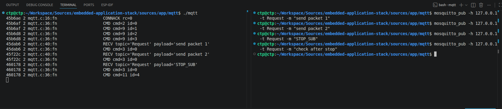
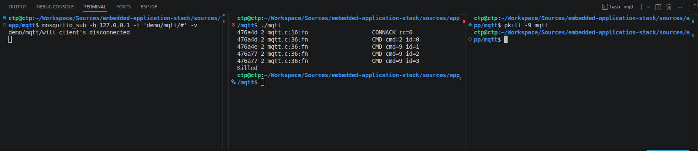
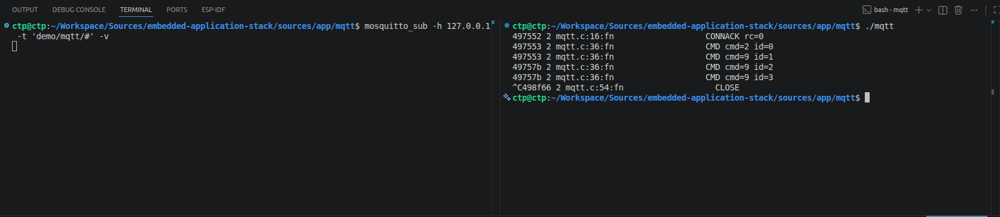
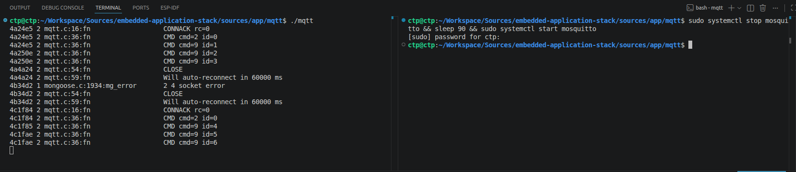
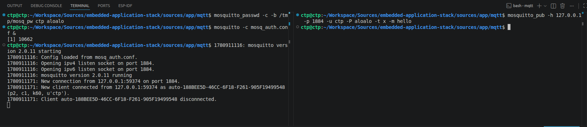
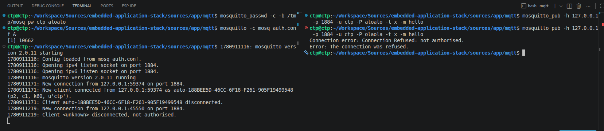
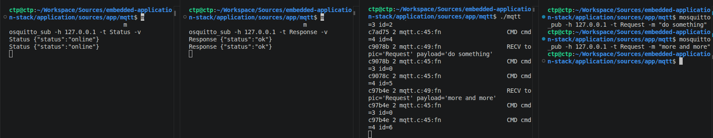

<h1 align="center">MQTT Study Report with the Mongoose Library</h1>

Welcome to the MQTT study report of this repository. The goal is to work through the Mongoose MQTT API on a Linux host, rewrite it into a single self-contained C file, connect it to a local Mosquitto broker, and cover every core MQTT feature end-to-end before porting to a real board.

---

## Table of Contents

- [I. Purpose](#i-purpose)
- [II. Folder Structure](#ii-folder-structure)
- [III. Mongoose API Reference](#iii-mongoose-api-reference)
- [IV. Callback Events](#iv-callback-events)
- [V. MQTT Command Codes in Logs](#v-mqtt-command-codes-in-logs)
- [VI. In-Code Configuration](#vi-in-code-configuration)
- [VII. Program Flow](#vii-program-flow)
- [VIII. Build and Run](#viii-build-and-run)
- [IX. Test Cases](#ix-test-cases)
  - [Test 1 - Subscribe, Receive, Unsubscribe on Command](#test-1---subscribe-receive-unsubscribe-on-command)
  - [Test 2 - Last Will Fires on Abrupt Disconnect](#test-2---last-will-fires-on-abrupt-disconnect)
  - [Test 3 - Graceful Disconnect: Will Does Not Fire](#test-3---graceful-disconnect-will-does-not-fire)
  - [Test 4 - Auto-Reconnect After Broker Restart](#test-4---auto-reconnect-after-broker-restart)
  - [Test 5 - Username / Password Authentication](#test-5---username--password-authentication)
  - [Test 6 - Publish: Client Sends Messages to the Broker](#test-6---publish-client-sends-messages-to-the-broker)
  - [Test 7 - TLS: Connecting via `mqtts://` with a Self-Signed CA](#test-7---tls-connecting-via-mqtts-with-a-self-signed-ca)
- [X. Conclusion](#x-conclusion)
- [XI. References](#xi-references)

---

## I. Purpose

Learn how to use the MQTT API of the Mongoose library, rewrite it into a single C file, connect to a broker (currently a local Mosquitto broker, since the code has not been ported to a board yet), and exercise the essential features: `sub`, `pub`, `unsub`, graceful `disconnect`, Last Will (abrupt disconnect / crash), auto-reconnect, and username/password authentication.

All source code lives in `mqtt.c`. The Mongoose library sits in the `lib` folder.

---

## II. Folder Structure

Relative to the repository root (`embedded-application-stack/`), the MQTT module lives at:

```
application/sources/app/mqtt/mqtt_client/
├── lib/
│   ├── mongoose.c          # upstream library
│   └── mongoose.h          # upstream library
├── certs/                  # self-signed CA + server cert (used in Test 7)
├── mqtt.c                  # main source
├── Makefile                # gcc build, links mongoose.c and mbedTLS
├── mosq_auth.conf          # Mosquitto config with auth enabled (used in Test 5)
└── mosq_tls.conf           # Mosquitto config with TLS enabled (used in Test 7)
```

This report (`mqtt-reporting.md`) lives at `docs/` under the repository root.

---

## III. Mongoose API Reference

The "Source Reference" column links directly to the declaration in `mongoose.h` and the implementation in `mongoose.c` for quick lookup:

| API | Role | Source Reference |
| --- | --- | --- |
| `mg_mgr_init(mgr)` | Initialize the event manager (epoll fd, ID counter) | [h:1805](../application/sources/app/mqtt/mqtt_client/lib/mongoose.h#L1805) - [c:7262](../application/sources/app/mqtt/mqtt_client/lib/mongoose.c#L7262) |
| `mg_mgr_poll(mgr, ms)` | Run one event-loop iteration, waiting up to `ms` milliseconds | [h:1804](../application/sources/app/mqtt/mqtt_client/lib/mongoose.h#L1804) - [c:13777](../application/sources/app/mqtt/mqtt_client/lib/mongoose.c#L13777) |
| `mg_mgr_free(mgr)` | Close every remaining connection and free resources | [h:1806](../application/sources/app/mqtt/mqtt_client/lib/mongoose.h#L1806) - [c:7242](../application/sources/app/mqtt/mqtt_client/lib/mongoose.c#L7242) |
| `mg_mqtt_connect(mgr, url, opts, fn, fn_data)` | Open TCP and send the CONNECT packet | [h:3088](../application/sources/app/mqtt/mqtt_client/lib/mongoose.h#L3088) - [c:6961](../application/sources/app/mqtt/mqtt_client/lib/mongoose.c#L6961) |
| `mg_mqtt_pub(c, opts)` | Send a PUBLISH packet; returns the `uint16_t` packet ID | [h:3094](../application/sources/app/mqtt/mqtt_client/lib/mongoose.h#L3094) - [c:6719](../application/sources/app/mqtt/mqtt_client/lib/mongoose.c#L6719) |
| `mg_mqtt_sub(c, opts)` | Send a SUBSCRIBE packet (one topic per call) | [h:3095](../application/sources/app/mqtt/mqtt_client/lib/mongoose.h#L3095) - [c:6779](../application/sources/app/mqtt/mqtt_client/lib/mongoose.c#L6779) |
| `mg_mqtt_unsub(c, opts)` | Send an UNSUBSCRIBE packet | [h:3096](../application/sources/app/mqtt/mqtt_client/lib/mongoose.h#L3096) - [c:6783](../application/sources/app/mqtt/mqtt_client/lib/mongoose.c#L6783) |
| `mg_mqtt_disconnect(c, opts)` | Send a DISCONNECT packet (2 bytes: `0xE0 0x00`) | [h:3102](../application/sources/app/mqtt/mqtt_client/lib/mongoose.h#L3102) - [c:6944](../application/sources/app/mqtt/mqtt_client/lib/mongoose.c#L6944) |
| `mg_str("...")` | Build a `struct mg_str` with `*buf` (data pointer) and `len` (size). Macro that expands to `mg_str_s()` | [h:1200](../application/sources/app/mqtt/mqtt_client/lib/mongoose.h#L1200) - [c:13938](../application/sources/app/mqtt/mqtt_client/lib/mongoose.c#L13938) |
| `mg_strcmp(s1, s2)` | Compare two `mg_str` values | [h:1205](../application/sources/app/mqtt/mqtt_client/lib/mongoose.h#L1205) - [c:13977](../application/sources/app/mqtt/mqtt_client/lib/mongoose.c#L13977) |
| `mg_millis()` | Current time in milliseconds since Unix epoch | [h:2943](../application/sources/app/mqtt/mqtt_client/lib/mongoose.h#L2943) - [c:24783](../application/sources/app/mqtt/mqtt_client/lib/mongoose.c#L24783) |
| `mg_log_set(level)` | Set log level (`MG_LL_ERROR/INFO/DEBUG/VERBOSE`). Macro that assigns `mg_log_level` | [h:1287](../application/sources/app/mqtt/mqtt_client/lib/mongoose.h#L1287) |
| `MG_INFO((...))` | Macro for INFO-level logging | [h:1333](../application/sources/app/mqtt/mqtt_client/lib/mongoose.h#L1333) |

---

## IV. Callback Events

```c
static void fn(struct mg_connection *c, int ev, void *ev_data);
```

| Event | When It Fires | `ev_data` | Reference |
| --- | --- | --- | --- |
| `MG_EV_MQTT_OPEN` | CONNACK received | `int *` = return code (0 = OK) | [h:1709](../application/sources/app/mqtt/mqtt_client/lib/mongoose.h#L1709) |
| `MG_EV_MQTT_CMD` | Any MQTT packet received | `struct mg_mqtt_message *` | [h:1707](../application/sources/app/mqtt/mqtt_client/lib/mongoose.h#L1707) |
| `MG_EV_MQTT_MSG` | PUBLISH received (message to a subscribed topic) | `struct mg_mqtt_message *` | [h:1708](../application/sources/app/mqtt/mqtt_client/lib/mongoose.h#L1708) |
| `MG_EV_CLOSE` | Connection closed | `NULL` | [h:1701](../application/sources/app/mqtt/mqtt_client/lib/mongoose.h#L1701) |

---

## V. MQTT Command Codes in Logs

When `MG_EV_MQTT_CMD` fires, the `m->cmd` field identifies the packet type:

| `cmd` | MQTT Packet Name | Meaning | Reference |
| --- | --- | --- | --- |
| 2 | CONNACK | Broker acknowledges the connect | [h:2996](../application/sources/app/mqtt/mqtt_client/lib/mongoose.h#L2996) |
| 3 | PUBLISH | Incoming message on a subscribed topic | [h:2997](../application/sources/app/mqtt/mqtt_client/lib/mongoose.h#L2997) |
| 4 | PUBACK | Broker acknowledges a QoS >= 1 message we just published | [h:2998](../application/sources/app/mqtt/mqtt_client/lib/mongoose.h#L2998) |
| 9 | SUBACK | Broker acknowledges a SUBSCRIBE packet | [h:3003](../application/sources/app/mqtt/mqtt_client/lib/mongoose.h#L3003) |
| 11 | UNSUBACK | Broker acknowledges an UNSUBSCRIBE packet | [h:3005](../application/sources/app/mqtt/mqtt_client/lib/mongoose.h#L3005) |
| 13 | PINGRESP | Broker replies to a keep-alive PING | [h:3007](../application/sources/app/mqtt/mqtt_client/lib/mongoose.h#L3007) |

---

## VI. In-Code Configuration

These parameters are hard-coded directly in the source for convenience during the study phase:

| Parameter | Value | Location |
| --- | --- | --- |
| Broker URL | `mqtt://127.0.0.1:1883` | 2nd argument of `mg_mqtt_connect` |
| Client ID | `client` | `opts.client_id` |
| Username | `ctp` | `opts.user` |
| Password | `aloalo` | `opts.pass` |
| Keep-alive | 60 seconds | `opts.keepalive` |
| MQTT version | 4 (MQTT 3.1.1) | `opts.version` |
| Clean session | `true` | `opts.clean` |
| Will topic | `demo/mqtt/will` | `opts.topic` |
| Will message | `client's disconnected` | `opts.message` |
| Will QoS | 1 | `opts.qos` |
| Subscribed topics | `Request`, `Signaling`, `Status` | Inside the `MG_EV_MQTT_OPEN` handler |
| Reconnect delay | 60000 ms (1 minute) | Macro `RECONNECT_MS` |

---

## VII. Program Flow

```
START
  |
  |-> mg_mgr_init                   create epoll fd
  |
  |-> signal(SIGINT/SIGTERM, ...)   register handler for Ctrl+C (used to test graceful disconnect)
  |
  |-> mg_mqtt_connect               open TCP and send CONNECT (with Will + user/pass)
  |
  v
  EVENT LOOP: while (!s_quit) mg_mgr_poll(1000)
  |
  |-[CONNACK rc=0]---> MG_EV_MQTT_OPEN
  |                       |-> mg_mqtt_sub x 3 (Request / Signaling / Status,
  |                           mirroring the 3 topics used by the reference camera source)
  |
  |-[any packet]-----> MG_EV_MQTT_CMD
  |                       |-> log cmd + id
  |
  |-[incoming PUBLISH]-> MG_EV_MQTT_MSG
  |                        |-> log topic + payload
  |                        |-> if payload == "STOP_SUB" -> mg_mqtt_unsub(that topic)
  |
  |-[connection closed]-> MG_EV_CLOSE
  |                        |-> s_reconnect_at = mg_millis() + 60000
  |                        (next poll iteration, main loop checks the timer -> calls mg_mqtt_connect again)
  |
  |-[Ctrl+C]---------> s_quit = 1 -> exit loop
                          |
                          |-> mg_mqtt_disconnect (send DISCONNECT cleanly)
                          |-> mg_mgr_poll x 5 (flush bytes onto the wire)
                          |-> mg_mgr_free
                          EXIT
```

---

## VIII. Build and Run

Requirements: `gcc`, `mbedTLS` development headers (`libmbedtls-dev`), and a `mosquitto` broker (listening on port 1883 with `allow_anonymous true`).

```bash
make            # build -> produces ./mqtt
./mqtt          # run
make clean      # remove the binary
```

Verify the broker:
```bash
systemctl is-active mosquitto       # -> "active"
mosquitto_pub -h 127.0.0.1 -t test -m hi
```

---

## IX. Test Cases

> **Note:** All test cases run on an Ubuntu host against a local Mosquitto broker. Nothing has been ported to a board yet.

### Test 1 - Subscribe, Receive, Unsubscribe on Command

**Purpose:** Verify the standard pub/sub flow between two independent clients, and demonstrate the client unsubscribing itself when the broker delivers a special command payload (`STOP_SUB`).

**Code references:**
- [`mqtt.c` L23-L41](../application/sources/app/mqtt/mqtt_client/mqtt.c#L23-L41) - `MG_EV_MQTT_OPEN` handler: subscribe to the three topics `Request`, `Signaling`, `Status` (one `mg_mqtt_sub` call each).
- [`mqtt.c` L76-L103](../application/sources/app/mqtt/mqtt_client/mqtt.c#L76-L103) - `MG_EV_MQTT_MSG` handler: log the payload and call `mg_mqtt_unsub` when the payload equals `"STOP_SUB"`.

**Setup:** two terminals.

**Terminal A - subscriber (our client):**
```bash
./mqtt
```

**Terminal B - publisher (`mosquitto_pub` sending messages):**
```bash
mosquitto_pub -h 127.0.0.1 -t Request -m "send packet 1"
mosquitto_pub -h 127.0.0.1 -t Request -m "send packet 2"
mosquitto_pub -h 127.0.0.1 -t Request -m "STOP_SUB"
mosquitto_pub -h 127.0.0.1 -t Request -m "check after stop"
```

<table align="center">
  <tr>
    <td align="center"></td>
  </tr>
</table>
<p align="center"><strong><em>Figure 1:</em></strong> Subscribe, publish, and unsubscribe</p>

**Reading the evidence (Figure 1):**

Terminal A (left) - `./mqtt` output:
```
CONNACK rc=0
CMD cmd=2 id=0                                  <- CONNACK echoed through MG_EV_MQTT_CMD
CMD cmd=9 id=1                                  <- SUBACK for 'Request'
CMD cmd=9 id=2                                  <- SUBACK for 'Signaling'
CMD cmd=9 id=3                                  <- SUBACK for 'Status'
RECV topic='Request' payload='send packet 1'
CMD cmd=3 id=0                                  <- incoming PUBLISH (QoS 0, id=0)
RECV topic='Request' payload='send packet 2'
CMD cmd=3 id=0
RECV topic='Request' payload='STOP_SUB'
CMD cmd=3 id=0
CMD cmd=11 id=4                                 <- UNSUBACK ('Request' unsubscribed)
```

The final message (`check after stop`) does **not** appear in Terminal A, exactly as expected: the client sent UNSUBSCRIBE for `Request` as soon as it processed `STOP_SUB`.

**Observations:**
- Every incoming MQTT packet fires **both** events: `MG_EV_MQTT_CMD` (for any packet, produces `CMD cmd=...` lines) **and** `MG_EV_MQTT_MSG` (for PUBLISH only, produces `RECV topic=... payload=...` lines). That is why each PUBLISH produces two consecutive log lines.
- `id=0` on the PUBLISH packets happens because `mosquitto_pub` defaults to QoS 0 (no packet identifier).
- Subscribing to three topics requires **three separate** `mg_mqtt_sub()` calls: each Mongoose SUBSCRIBE packet carries exactly one topic.
- `mg_mqtt_unsub()` needs only one call; the broker returns UNSUBACK immediately (id=4, right after the initial three SUBACKs).

---

### Test 2 - Last Will Fires on Abrupt Disconnect

**Purpose:** Verify the Last Will and Testament (LWT) mechanism: when the client dies unexpectedly (power loss, crash, network drop), the broker automatically publishes the "will" message on the Will topic so other clients can react. `pkill -9 mqtt` simulates a sudden crash (SIGKILL cannot be caught, so the signal handler never runs).

**Code references:**
- [`mqtt.c` L130-L132](../application/sources/app/mqtt/mqtt_client/mqtt.c#L130-L132) - Will fields in `s_opts`: `topic` = `demo/mqtt/will`, `message` = `client's disconnected`, `qos` = 1.
- [`mqtt.c` L138](../application/sources/app/mqtt/mqtt_client/mqtt.c#L138) - `mg_mqtt_connect` call with `&s_opts` so Mongoose encodes the Will into the CONNECT packet.

**Setup:** three terminals.

**Terminal A - Will watcher:**
```bash
mosquitto_sub -h 127.0.0.1 -t 'demo/mqtt/#' -v
```
(Wildcard `#` shows every topic under `demo/mqtt/`.)

**Terminal B - run the client:**
```bash
./mqtt
```

**Terminal C - kill -9 (simulated crash):**
```bash
pkill -9 mqtt
```

<table align="center">
  <tr>
    <td align="center"></td>
  </tr>
</table>
<p align="center"><strong><em>Figure 2:</em></strong> Last Will and Testament (LWT)</p>

**Reading the evidence (Figure 2):**

- Terminal A (left): prints exactly one line, `demo/mqtt/will client's disconnected`, right after the process is killed.
- Terminal B (middle): shows `CONNACK rc=0` and three SUBACK lines (`CMD cmd=9 id=1/2/3`), then the shell prints `Killed`. The process was terminated by SIGKILL from outside; there is **no** `CLOSE` line because SIGKILL cannot be caught, the signal handler never ran, and the app had no chance to log anything further.
- Terminal C (right): just the `pkill -9 mqtt` command.

**Broker logic:** the broker sees the TCP socket half-close (FIN/RST) without having received a proper DISCONNECT packet, treats the client as crashed, and fires the Will message on the topic that was registered in CONNECT.

**Meaning:**
- `opts.topic` + `opts.message` in the CONNECT options are the **Will topic** and **Will payload**, not a regular data topic to publish on.
- `opts.qos` in `mg_mqtt_opts` at `mg_mqtt_connect()` time is actually the **Will QoS** (bits 3 and 4 of the Connect Flags byte).
- To trigger the Will, `kill -9` (SIGKILL) is **required**. Other exit paths (Ctrl+C -> SIGINT, `kill` -> SIGTERM, `pkill` without `-9`) reach the signal handler, the app sends DISCONNECT first, and the broker treats the exit as intentional, so the Will does not fire (see Test 3).

---

### Test 3 - Graceful Disconnect: Will Does Not Fire

**Purpose:** Verify that when the client sends a proper MQTT DISCONNECT packet, the broker does **not** fire the Will. This is how a well-behaved application should shut down.

**Code references:**
- [`mqtt.c` L9-L14](../application/sources/app/mqtt/mqtt_client/mqtt.c#L9-L14) - `s_quit` flag and the `on_sigint` signal handler that sets it.
- [`mqtt.c` L134-L135](../application/sources/app/mqtt/mqtt_client/mqtt.c#L134-L135) - handler registration for `SIGINT` and `SIGTERM`.
- [`mqtt.c` L159-L167](../application/sources/app/mqtt/mqtt_client/mqtt.c#L159-L167) - after the main loop exits: call `mg_mqtt_disconnect`, then poll 5 times x 100ms to flush bytes to the socket before `mg_mgr_free`.

**Setup:** two terminals.

**Terminal A - Will watcher:**
```bash
mosquitto_sub -h 127.0.0.1 -t 'demo/mqtt/#' -v
```

**Terminal B - run the client and press Ctrl+C:**
```bash
./mqtt
# (wait a few seconds for CONNACK + 3 SUBACKs)
# Press Ctrl+C
```

<table align="center">
  <tr>
    <td align="center"></td>
  </tr>
</table>
<p align="center"><strong><em>Figure 3:</em></strong> Graceful disconnect</p>

**Reading the evidence (Figure 3):**

- Terminal A (left): only the `mosquitto_sub` command line; no output at all -> the Will was **not** published by the broker.
- Terminal B (right) - `./mqtt` output:
  ```
  CONNACK rc=0
  CMD cmd=2 id=0          <- CONNACK echoed through MG_EV_MQTT_CMD
  CMD cmd=9 id=1          <- SUBACK 'Request'
  CMD cmd=9 id=2          <- SUBACK 'Signaling'
  CMD cmd=9 id=3          <- SUBACK 'Status'
  ^C                      <- Ctrl+C
  CLOSE                   <- MG_EV_CLOSE fires after mg_mqtt_disconnect()
                          -> mg_mgr_free closes the socket
  ```

**Meaning:**
- Mongoose does **not** trap signals itself; that is the job of libc via `<signal.h>`. The canonical pattern is:
  1. `signal(SIGINT, handler)` registers the handler.
  2. The handler sets `s_quit = 1` (volatile so the compiler does not optimize it away).
  3. The main loop checks `!s_quit` and exits when the flag is set.
  4. Call `mg_mqtt_disconnect()` to send a proper DISCONNECT packet.
  5. Poll a few more iterations (five iterations x 100ms here) to **flush** the buffered bytes to the socket.
  6. `mg_mgr_free()` closes and releases everything.

- The flush step in (5) is critical: `mg_mqtt_disconnect()` only **pushes 2 bytes (`0xE0 0x00`) into the connection's send buffer**; the bytes are not yet on the wire. `mg_mgr_poll()` needs to run a few more times so that epoll grants write readiness and the kernel `send()` actually goes out.

---

### Test 4 - Auto-Reconnect After Broker Restart

**Purpose:** Verify that the client reconnects on its own after the broker is stopped and started again. Broker restarts and network glitches are normal events, and the application has to survive them.

**Code references:**
- [`mqtt.c` L4](../application/sources/app/mqtt/mqtt_client/mqtt.c#L4) - `RECONNECT_MS = 60000` macro (1 minute).
- [`mqtt.c` L104-L114](../application/sources/app/mqtt/mqtt_client/mqtt.c#L104-L114) - `MG_EV_CLOSE` handler: set `s_reconnect_at = mg_millis() + RECONNECT_MS` when the connection drops.
- [`mqtt.c` L146-L156](../application/sources/app/mqtt/mqtt_client/mqtt.c#L146-L156) - main loop checks `s_reconnect_at` on every poll iteration and calls `mg_mqtt_connect` again when the deadline hits.
- [`mqtt.c` L23-L41](../application/sources/app/mqtt/mqtt_client/mqtt.c#L23-L41) - the three subscriptions live inside `MG_EV_MQTT_OPEN`, so they re-subscribe automatically after every reconnect. No extra code needed.

**Setup:** two terminals. The main broker at `127.0.0.1:1883` (managed by `systemd`) is stopped and restarted to simulate a temporary broker outage.

`RECONNECT_MS = 60000` (1 minute) is hard-coded. On a board this can be tuned to whatever the deployment requires; one minute is a convenient trade-off during study, since it is short enough to avoid long waits but long enough to see the reconnect timer behaviour clearly.

**Terminal A - run the client:**
```bash
./mqtt
```
Wait for `CONNACK rc=0` followed by three `CMD cmd=9` lines (all three topics subscribed).

**Terminal B - stop the broker, wait, then start it again:**
```bash
sudo systemctl stop mosquitto && sleep 90 && sudo systemctl start mosquitto
```

<table align="center">
  <tr>
    <td align="center"></td>
  </tr>
</table>
<p align="center"><strong><em>Figure 4:</em></strong> Auto-reconnect</p>

**Reading the evidence (Figure 4), three clear phases:**

```
[Phase 1 - initial connection, broker alive]
CONNACK rc=0
CMD cmd=2 id=0
CMD cmd=9 id=1                         <- SUBACK 'Request'
CMD cmd=9 id=2                         <- SUBACK 'Signaling'
CMD cmd=9 id=3                         <- SUBACK 'Status'

[Phase 2 - broker stopped, TCP drops]
CLOSE                                  <- MG_EV_CLOSE fires as soon as TCP is lost
Will auto-reconnect in 60000 ms        <- reconnect timer armed

[Phase 2.5 - 60s later, broker still down, connect fails]
mongoose.c:1934:mg_error 2 4 socket error   <- internal Mongoose log: connect() refused
CLOSE                                  <- MG_EV_CLOSE fires again
Will auto-reconnect in 60000 ms        <- timer rearmed, wait another 60s

[Phase 3 - 60s later, broker back up, reconnect succeeds]
CONNACK rc=0
CMD cmd=2 id=0
CMD cmd=9 id=4                         <- SUBACK 'Request' (second time)
CMD cmd=9 id=5                         <- SUBACK 'Signaling'
CMD cmd=9 id=6                         <- SUBACK 'Status'
```

**Key observations:**
- Packet IDs grow monotonically (1, 2, 3 on the first connect, then 4, 5, 6 on reconnect). Mongoose uses a single counter for the whole manager and does not reset it when a new connection opens.
- `mongoose.c:1934:mg_error 2 4 socket error` is the default Mongoose log emitted when the `connect()` syscall fails; the "2 4" pair is `(fd, errno)` from internal debug output.

**Takeaways:**
- Mongoose has **no** built-in auto-reconnect, so it has to be coded by hand: inside `MG_EV_CLOSE` set `s_reconnect_at = mg_millis() + RECONNECT_MS`, and inside the main loop call `mg_mqtt_connect()` again once `mg_millis() >= s_reconnect_at`.
- Convenient side effect: because the three subscriptions live inside `MG_EV_MQTT_OPEN`, and that event fires on every CONNACK (including after reconnect), the topics are automatically re-subscribed on every reconnect without any extra logic in the main loop.
- To call `mg_mqtt_connect()` from the main loop (during reconnect), `mgr` and `opts` have to be `static` globals, not locals inside `main()` as in the first version of the code.

---

### Test 5 - Username / Password Authentication

**Purpose:** The code sets `opts.user = "ctp"` and `opts.pass = "aloalo"`, but the default broker on port `1883` runs with `allow_anonymous true`, so it accepts anything and the auth path never gets exercised. To actually verify authentication in both directions (correct password -> OK, wrong password -> reject), a second broker on port `1884` is set up with `allow_anonymous false` and a `password_file`.

**Code references:**
- [`mqtt.c` L128-L129](../application/sources/app/mqtt/mqtt_client/mqtt.c#L128-L129) - `s_opts.user = "ctp"` and `s_opts.pass = "aloalo"` so Mongoose encodes them into the CONNECT packet (setting the User Name Flag and Password Flag).
- [`mqtt.c` L25](../application/sources/app/mqtt/mqtt_client/mqtt.c#L25) - log the CONNACK return code inside `MG_EV_MQTT_OPEN` (rc=0 = accepted, rc=5 = not authorized).

**Auth broker setup (one-time):**

```bash
# Create the password file (user = ctp, password = aloalo, stored at /tmp/mosq_pw)
mosquitto_passwd -c -b /tmp/mosq_pw ctp aloalo

# Run the auth broker on port 1884 (separate terminal, background)
mosquitto -c mosq_auth.conf &
```

Contents of `mosq_auth.conf`:
```
listener 1884
allow_anonymous false
password_file /tmp/mosq_pw
persistence false
```

#### Test 5a - Verify Auth Broker: Correct Password

Before touching `./mqtt`, verify that the auth broker itself works by using `mosquitto_pub`:

```bash
mosquitto_pub -h 127.0.0.1 -p 1884 -u ctp -P aloalo -t x -m hello
```

<table align="center">
  <tr>
    <td align="center"></td>
  </tr>
</table>
<p align="center"><strong><em>Figure 5a:</em></strong> Broker accepts client with correct password</p>

**Reading the evidence (Figure 5a):**

- Left terminal - broker log (`mosquitto -c mosq_auth.conf`):
  ```
  mosquitto version 2.0.11 starting
  Config loaded from mosq_auth.conf.
  Opening ipv4 listen socket on port 1884.
  Opening ipv6 listen socket on port 1884.
  mosquitto version 2.0.11 running
  New connection from 127.0.0.1:59374 on port 1884.
  New client connected from 127.0.0.1:59374 as auto-188BEE5D-... (p2, c1, k60, u'ctp').
  Client auto-188BEE5D-... disconnected.
  ```
  The `u'ctp'` field shows that the broker parsed the username out of the CONNECT packet and validated the password successfully.

- Right terminal - client command and result: `mosquitto_pub -h 127.0.0.1 -p 1884 -u ctp -P aloalo -t x -m hello` exits immediately with no error, so the broker accepted the connection.

If the URL in `mqtt.c` is changed to `mqtt://127.0.0.1:1884` and the binary rebuilt, `./mqtt` prints `CONNACK rc=0` followed by three `CMD cmd=9` lines exactly like in Test 1: the broker treats `mosquitto_pub` and `./mqtt` identically once the credentials are valid.

#### Test 5b - Verify Auth Broker: Wrong Password

```bash
mosquitto_pub -h 127.0.0.1 -p 1884 -u ctp -P olaola -t x -m hello
```

<table align="center">
  <tr>
    <td align="center"></td>
  </tr>
</table>
<p align="center"><strong><em>Figure 5b:</em></strong> Broker rejects client with wrong password</p>

**Reading the evidence (Figure 5b):**

- Left terminal - broker log has two extra lines compared with Figure 5a:
  ```
  New connection from 127.0.0.1:45550 on port 1884.
  Client <unknown> disconnected, not authorised.
  ```
  Note `Client <unknown>`: the broker rejects the client **before** it accepts the username, so `u'ctp'` never gets logged.

- Right terminal - `mosquitto_pub` output:
  ```
  Connection error: Connection Refused: not authorised.
  Error: The connection was refused.
  ```

If `opts.pass = mg_str("olaola")` is set in `mqtt.c` and the binary rebuilt, `./mqtt` receives CONNACK with return code 5 ("not authorized" per the MQTT 3.1.1 spec). `MG_EV_MQTT_OPEN` logs `CONNACK rc=5`, then Mongoose sets `c->is_closing = 1` at [mongoose.c:6877](../application/sources/app/mqtt/mqtt_client/lib/mongoose.c#L6877), which fires `MG_EV_CLOSE`. The auto-reconnect logic still kicks in but is futile because the password is still wrong, so the client loops forever until the user intervenes.

**Test 5 takeaways:**
- `opts.user` and `opts.pass` are encoded by Mongoose into the CONNECT packet: it sets the "User Name Flag" and "Password Flag" bits in the Connect Flags byte and appends both length-prefixed strings to the payload.
- CONNACK return codes per the MQTT 3.1.1 spec:
  - `0` = accepted
  - `1` = unacceptable protocol version
  - `2` = identifier rejected (invalid client_id)
  - `3` = server unavailable
  - `4` = bad user name or password (malformed)
  - `5` = not authorized (well-formed but the broker rejects)
- Mosquitto 2.x returns `rc=5` for both "wrong password" and "unknown user" without distinguishing them, to avoid information leaks.

**Restore after the test:** switch the URL back to `1883` and `opts.pass = "aloalo"`, and stop the auth broker with `pkill -f mosq_auth`.

---

### Test 6 - Publish: Client Sends Messages to the Broker

**Purpose:** Verify that the client can actually publish messages to the broker via `mg_mqtt_pub()`. Two publish scenarios are exercised in the code:
1. When CONNACK arrives, publish `{"status":"online"}` on topic `Status` with `retain=true` to announce to the cloud that the "camera" is online.
2. Every time a message arrives on topic `Request`, publish `{"status":"ok"}` on topic `Response` to simulate answering a command from the cloud.

**Code references:**
- [`mqtt.c` L43-L50](../application/sources/app/mqtt/mqtt_client/mqtt.c#L43-L50) - publish the `online` status at the end of `MG_EV_MQTT_OPEN`.
- [`mqtt.c` L83-L91](../application/sources/app/mqtt/mqtt_client/mqtt.c#L83-L91) - publish the response inside `MG_EV_MQTT_MSG` whenever a message arrives on `Request`.

**Setup:** four terminals.

**Terminal 1 - external subscriber for `Status` (to see the `online` message):**
```bash
mosquitto_sub -h 127.0.0.1 -t Status -v
```

**Terminal 2 - external subscriber for `Response` (to see replies to Requests):**
```bash
mosquitto_sub -h 127.0.0.1 -t Response -v
```

**Terminal 3 - run the client:**
```bash
./mqtt
```

**Terminal 4 - send two commands on `Request`:**
```bash
mosquitto_pub -h 127.0.0.1 -t Request -m "do something"
mosquitto_pub -h 127.0.0.1 -t Request -m "more and more"
```

<table align="center">
  <tr>
    <td align="center"></td>
  </tr>
</table>
<p align="center"><strong><em>Figure 6:</em></strong> Publish</p>

**Reading the evidence (Figure 6):**

Terminal 1 (leftmost) - `mosquitto_sub -t Status`: prints two `Status {"status":"online"}` lines. The first line is the **retained message** the broker delivers as soon as the subscriber connects (a previous test published Status with `retain=true`, so the broker keeps it). The second line is the message that `./mqtt` publishes on CONNACK during the current run.

Terminal 2 (left-middle) - `mosquitto_sub -t Response`: prints two `Response {"status":"ok"}` lines, one for each `Request` command sent from Terminal 4.

Terminal 3 (middle-right) - `./mqtt` output (the first three SUBACK lines have scrolled out of view):
```
CMD cmd=3 id=2                              <- broker forwards a PUBLISH back (Status retain loop-back)
CMD cmd=4 id=4                              <- PUBACK for the Status message the client itself published (id=4)
RECV topic='Request' payload='do something' <- message from Terminal 4
CMD cmd=3 id=0                              <- PUBLISH event for Request (mosquitto_pub defaults to QoS 0, id=0)
CMD cmd=4 id=5                              <- PUBACK for the Response the client just published (id=5)
RECV topic='Request' payload='more and more'
CMD cmd=3 id=0
CMD cmd=4 id=6                              <- PUBACK for the second Response (id=6)
```

Terminal 4 (rightmost) - publisher: the two commands `mosquitto_pub -t Request -m "do something"` and `-m "more and more"`.

**Observations:**
- `mg_mqtt_pub()` is a single call. The broker returns a PUBACK (`cmd=4`) because the client publishes with QoS 1. Three PUBACKs appear in a row: `id=4` for Status `online`, then `id=5` and `id=6` for the two Responses. Packet IDs grow monotonically from Mongoose's shared counter (after the initial three SUBACKs with `id=1/2/3` come the PUBLISH `id=4` for Status and the two PUBLISHes `id=5/6` for Response).
- `retain=true` on the Status publish tells the broker to keep the message. Subscribers that **connect later** still receive it, which is why Terminal 1 prints the `online` line the moment its subscription is complete (before `./mqtt` has published anything in the current run).
- Because the client also subscribes to the `Status` topic that it publishes on, the broker forwards the message back to the client (loop-back). This is Mosquitto's default behaviour. The `CMD cmd=3 id=2` line at the top of the screenshot is that loop-back PUBLISH (the broker assigns its own packet ID for downlink, unrelated to the client's counter).

---

### Test 7 - TLS: Connecting via `mqtts://` with a Self-Signed CA

**Purpose:** Upgrade the connection from plain TCP (`mqtt://`) to TLS (`mqtts://`) to encrypt the traffic between client and broker. Two things get verified: (a) TLS handshake succeeds with the correct CA, and pub/sub still works normally; (b) the handshake fails with the wrong CA and the connection is rejected at the TLS stage.

**Code references:**
- [`mqtt.c` L5-L6](../application/sources/app/mqtt/mqtt_client/mqtt.c#L5-L6) - switch the URL to `mqtts://localhost:8883` and set `CA_CERT_PATH = "certs/ca.crt"` (the self-signed CA of the local broker). The system trust store is not used because mbedTLS cannot ingest a 220 KB bundle of 147 certificates when default builds do not enable every algorithm needed to parse them.
- [`mqtt.c` L52-L70](../application/sources/app/mqtt/mqtt_client/mqtt.c#L52-L70) - `MG_EV_CONNECT` handler: read the CA file with `mg_file_read`, then call `mg_tls_init(c, &opts)` with `opts.ca` set to the CA contents and `opts.name` set to the host parsed from the URL (used for both SNI and CN/SAN verification).
- [`Makefile` L2-L3](../application/sources/app/mqtt/mqtt_client/Makefile#L2-L3) - enable the mbedTLS backend: `-DMG_TLS=MG_TLS_MBED` plus `-lmbedtls -lmbedx509 -lmbedcrypto`.

#### Phase 1 - Set Up CA, Cert, and Broker (one-time)

TLS artifacts live in the `certs/` folder next to `mqtt.c`:

```bash
mkdir -p certs && cd certs

# Self-signed CA
openssl genrsa -out ca.key 2048
openssl req -new -x509 -days 3650 -key ca.key -out ca.crt \
  -subj "/C=VN/ST=HCM/O=CTP-Test/CN=ctp-test-ca"

# Server cert signed by the CA, SAN covers both IP and DNS
openssl genrsa -out server.key 2048
openssl req -new -key server.key -out server.csr \
  -subj "/C=VN/ST=HCM/O=CTP-Test/CN=127.0.0.1"
cat > server.ext <<'EOF'
subjectAltName = @alt_names
[alt_names]
IP.1  = 127.0.0.1
DNS.1 = localhost
EOF
openssl x509 -req -in server.csr -CA ca.crt -CAkey ca.key -CAcreateserial \
  -out server.crt -days 3650 -extfile server.ext

cd ..
```

Broker config (`mosq_tls.conf`, next to `mqtt.c`):

```
listener 8883
allow_anonymous true
cafile   certs/ca.crt
certfile certs/server.crt
keyfile  certs/server.key
persistence false
```

> **Note:** The `certs/` folder is already listed in `.gitignore`.

#### Phase 2 - Test 7a: Pub/Sub over TLS (positive)

**Setup:** three terminals, all inside the `mqtt_client/` directory.

**Terminal A - TLS broker:**
```bash
mosquitto -c mosq_tls.conf -v
```

**Terminal B - run the TLS client:**
```bash
./mqtt
```

**Terminal C - publish over TLS with mosquitto_pub:**
```bash
mosquitto_pub -h localhost -p 8883 --cafile certs/ca.crt -t Request -m "tls hello"
mosquitto_pub -h localhost -p 8883 --cafile certs/ca.crt -t Request -m "STOP_SUB"
mosquitto_pub -h localhost -p 8883 --cafile certs/ca.crt -t Request -m "after stop"
```

**Reading the evidence - Terminal B (`./mqtt`) log:**

```
CONNACK rc=0                                          <- TLS handshake done + MQTT CONNECT accepted
CMD cmd=2 id=0                                        <- CONNACK echoed through MG_EV_MQTT_CMD
CMD cmd=9 id=1                                        <- SUBACK 'Request'
CMD cmd=9 id=2                                        <- SUBACK 'Signaling'
CMD cmd=9 id=3                                        <- SUBACK 'Status'
RECV topic='Status' payload='{"status":"online"}'     <- retained message from a previous test
RECV topic='Status' payload='{"status":"online"}'     <- client's own publish on CONNACK (loop-back)
CMD cmd=4 id=4                                        <- PUBACK for the Status message we published
RECV topic='Request' payload='tls hello'              <- message from Terminal C
CMD cmd=4 id=5                                        <- PUBACK for the Response we published
RECV topic='Request' payload='STOP_SUB'
CMD cmd=4 id=6                                        <- PUBACK for the second Response
CMD cmd=11 id=7                                       <- UNSUBACK ('Request' unsubscribed)
CLOSE                                                 <- Ctrl+C -> graceful disconnect
```

The `"after stop"` message does **not** appear in Terminal B, exactly as expected: the client already sent UNSUBSCRIBE for `Request` after receiving `STOP_SUB`. The Test 1 logic still works unchanged over the TLS channel.

#### Phase 3 - Test 7b: Wrong CA -> Handshake Fails (negative)

To prove that the client actually verifies the certificate rather than silently bypassing it, temporarily change `CA_CERT_PATH = "/tmp/wrong-ca.pem"` (a junk file that is not a valid PEM), rebuild, and run:

```
mongoose.c:19470:mg_load_cert  cert err 0x2180        <- mbedTLS cannot parse the CA file
mongoose.c:1934:mg_error       1 4 socket error
CLOSE
Will auto-reconnect in 60000 ms                       <- auto-reconnect logic still kicks in
```

**Meaning:** mbedTLS fails at the **load CA** step (error `0x2180` = `MBEDTLS_ERR_PEM_NO_HEADER_FOOTER_PRESENT`) before it even reaches the handshake. If the file is replaced with a valid CA that does not match the broker's cert, the error becomes `X509 - Certificate verification failed` (`-0x2700`) during the handshake, also ending in `CLOSE` and a reconnect attempt. Both cases confirm that the code does not skip TLS verification.

**Test 7 takeaways:**
- Upgrading `mqtt://` to `mqtts://` from the code's point of view means adding an `MG_EV_CONNECT` handler that calls `mg_tls_init()`. Mongoose handles the encrypt/decrypt work after that, and the `mg_mqtt_pub/sub/unsub` APIs stay unchanged.
- `opts.name` in `mg_tls_opts` is used for **two** things: SNI (the Server Name Indication in the TLS ClientHello) and hostname verification against the server cert's CN/SAN. It has to match the broker's cert or the handshake fails.
- mbedTLS is stricter than OpenSSL about supported algorithms and validation rules. The safe pattern for embedded targets is to **pin exactly one CA** that you trust (a small, self-contained file) rather than loading the full system trust store.
- All of Tests 1-6 above run over plain TCP `mqtt://127.0.0.1:1883`. To re-run them over TLS, set `MQTT_SERVER_URL` to `mqtts://localhost:8883`, run the broker with `mosq_tls.conf`, and add `-p 8883 --cafile certs/ca.crt` to every `mosquitto_pub/sub` command.

---

## X. Conclusion

### Pitfall: `opts.qos` in CONNECT

`opts.qos` at `mg_mqtt_connect()` time is actually the **Will QoS** (bits 3-4 of the Connect Flags byte in the CONNECT packet), not the QoS for publish or subscribe. Setting `qos != 0` without a Will (empty `opts.topic`) makes the broker reject CONNECT per MQTT-3.1.2-13.

The correct approach: pass the publish or subscribe QoS **separately** via `opts.qos` at `mg_mqtt_pub()` / `mg_mqtt_sub()` time, not at CONNECT.

### Signal Handling Belongs to libc, Not Mongoose

Mongoose does not touch signals; the application has to call `signal()` from `<signal.h>` itself to trap SIGINT/SIGTERM. Without a handler the kernel terminates the process immediately, the DISCONNECT packet never goes out, and the broker treats the exit as a crash and fires the Will (as in Test 2).

The canonical pattern: set a flag inside the handler, check the flag in the main loop, exit the loop, call `mg_mqtt_disconnect()`, poll a few more times to flush, then `mg_mgr_free()`.

### Subscribing to Multiple Topics Requires Multiple `mg_mqtt_sub()` Calls

Every `mg_mqtt_sub()` call sends a single SUBSCRIBE packet carrying **exactly one topic**. Subscribing to three topics means three separate calls, and the broker returns three separate SUBACKs with three different packet IDs (visible in Figures 1 and 4).

### Mongoose Does Not Ship an Auto-Reconnect

It has to be written by hand:
- Inside `MG_EV_CLOSE`: `s_reconnect_at = mg_millis() + RECONNECT_MS`.
- In the main loop, check `mg_millis() >= s_reconnect_at` and call `mg_mqtt_connect()` again.
- `mgr` and `opts` must be `static` globals so the main loop can reach them.

Bonus: because the subscribe calls live inside `MG_EV_MQTT_OPEN` (which fires on every CONNACK), the three topics are automatically re-subscribed after each reconnect, without any extra code.

---

## XI. References

- Mongoose upstream repository: <https://github.com/cesanta/mongoose>
- Cesanta documentation hub: <https://mongoose.ws/documentation/>
- MQTT Client tutorial: <https://mongoose.ws/documentation/tutorials/mqtt/mqtt-client/>
- MQTT Server tutorial: <https://mongoose.ws/documentation/tutorials/mqtt/mqtt-server/>
